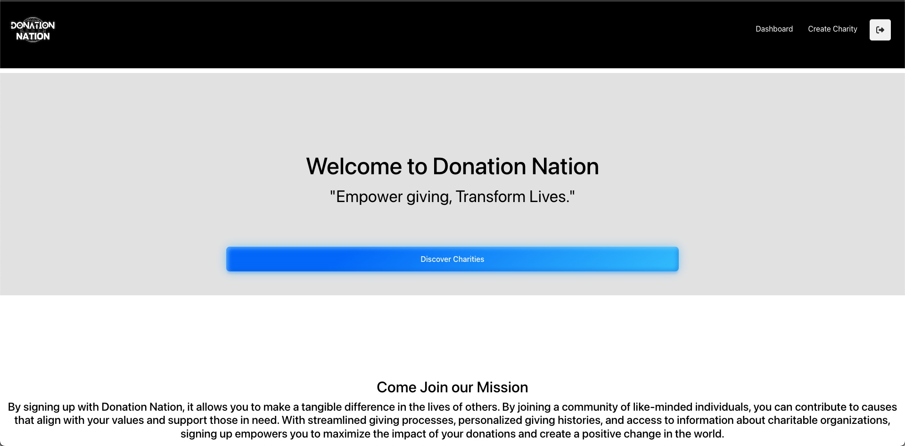

# Donation Nation

Donation Nation is a full-stack React application which functions as a charity page. On the page, there exists pre existing charities which users can donate money  towards using Stripe. Users can also create their own charities and receive donations.


## Features

- Able to creat a charity
- Password locked 
- Link to payment
- Able to render server side seeds on the client side page
## Run Locally & Deploy

Clone the project

```bash
  git clone https://link-to-project
```

Go to the project directory

```bash
  cd my-project
```

Install dependencies

```bash
  npm install
```

Start the server

```bash
  npm run start
```

In order to deploy this project client and server together run
  
  ```bash
  npm run deploy
```
## Tech Stack

**Client:** React, Redux, graphql, mongoose, node, web-vitals, bcrypt

**Server:** Node, Express, apollo-server-express, bcrypt, graphql, mongoose, jsonwebtoken, apollo, stripe


## Authors
Name - GitHub account names 
- Danny - Danny2727
- John Shirey - jpshirey5
- Hannah Patterson - pattersonhn
- Austin Nobregas - Anobregas
- Abraham Reto - vampiro832

## Screenshot

## Deployment Link
https://donation-nation.herokuapp.com/